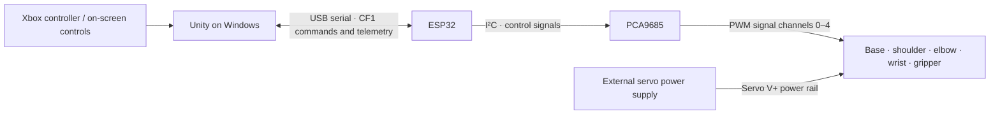

# 4-DOF Robotic Arm

A custom 3D-printed robotic arm developed through mechanical design, embedded control, electronics integration, and Unity-based control.

  

**[Portfolio Case Study](https://oluwaseuno.com/robotic-arm.html) · [Watch the Demo](https://oluwaseuno.com/robotic-arm.html#arm-demo) · [LinkedIn](https://www.linkedin.com/in/ojomodel)**

## Overview

I built this arm to learn how mechanical design, electronics, and software come together in a physical system. It has **four positioning joints—base, shoulder, elbow, and wrist—plus a separately actuated gripper**, using five servo channels.

My work included designing and modifying the assembly in Fusion 360, 3D printing and assembling the components, integrating MG996R servos with an ESP32 and PCA9685, working on the Unity control interface, and testing and redesigning the physical robot.

| At a glance | |
| --- | --- |
| Main challenge | Too much arm mass and reach for the original compact base; wobble and loose printed fits |
| Design response | Slimmer links, a wider base, revised gripper geometry, and more space for electronics |
| Control | Unity interface and Xbox input → USB serial → ESP32 → PCA9685 → servos |
| Result | A working physical build with improved stability, demonstrated in the portfolio video |
| This repository | Real firmware, selected Unity runtime source, project photographs, and engineering notes |

## Technologies

Fusion 360 · ESP32 · Arduino / C++ · PCA9685 · MG996R servos · Unity / C# · FDM 3D printing · Git

## System Architecture

USB connects the PC and ESP32. The PCA9685 generates the five servo control signals. **The servos use a separate external power supply, not the ESP32 power pin.** The control electronics and servo supply share a ground reference. The diagram separates command signals from power; it is not a complete wiring schematic. See [Electronics](electronics/README.md) for the source-verified pin and channel mapping.

## Engineering Iteration

The first arm was too heavy for its small base. Its mass and reach caused wobbling, and some printed connections had more play than I wanted. I was still learning how CAD clearances translate into FDM printed fits.

I redesigned almost the entire arm: slimmer components reduced unnecessary bulk, a larger base improved support, revised gripper geometry made the wrist assembly more practical, and a larger electronics enclosure created more room for components and wiring. Physical testing guided these changes. Stability improved; payload capacity and positioning accuracy have not been measured.

## Redesign

| Earlier version | Current version |
| :---: | :---: |
|  |  |
| Heavier structure, compact base, more mechanical play, earlier gripper geometry | Slimmer structure, wider base, improved stability, more refined gripper geometry |

These are workshop photographs from different camera angles. Electronics packaging also evolved in CAD; the current photo does not show every later enclosure revision. [Design notes](docs/design-notes.md) explain the iterations and earlier prototypes.

## Design for 3D Printing

A fit on screen does not guarantee a tight physical fit after FDM printing. I learned to consider tolerances and clearances, print prototypes, test the actual mating parts, and revise the geometry based on the results.

## Software

The source below comes from the existing robot project. This is a curated source snapshot, not a complete Unity project or a ready-to-flash configuration for another robot.

| Component | What the included source does |
| --- | --- |
| [ESP32 / Arduino](firmware/README.md) | Parses USB commands, manages activation and hold/release states, generates PCA9685 outputs, and buffers timestamped motion samples |
| [Unity / C#](unity/README.md) | Provides joint and Xbox controls, forward and inverse kinematics, USB communication, model-to-servo mapping, and task recording/playback |

The IK implementation is position-based and bounded. It does not establish collision-free motion, exact tool orientation, or measured physical accuracy. Recorded motion contains commanded joint positions and timestamps; serial telemetry is also commanded state, not shaft-position feedback.

## Current Status

### Working

- Physical printed arm with four positioning joints and an actuated gripper; movement is shown in the demo.
- ESP32 USB command communication and PCA9685 control of the five servo channels.
- Unity joint controls and Xbox input, with physical correspondence observed during testing.
- Implemented forward/position IK, Cartesian control, and task recording/playback in the software. These capabilities have source and development validation; a completed physical replay trial is not claimed here.
- Mechanical redesign with improved stability reported during use.

### In Development

- Broader physical calibration and workspace validation.
- Smoother coordinated movement and further trajectory refinement.
- Physical validation of recorded-task playback.
- Measured repeatability, positioning accuracy, and payload characterization.
- Further mechanical fit, wiring, and enclosure refinements.

## Development Notes

During repeated testing, the ESP32 occasionally needed a manual reset when reconnecting the control system. A single technical cause was not conclusively identified.

The source includes different control modes and robot-specific limits. A software command limit is not a measured servo speed or a verified collision-free operating range. Build and configuration details are documented beside the code; no hardware is automatically connected or operated by this repository.

## Demo

**[Watch the physical arm in action →](https://oluwaseuno.com/robotic-arm.html#arm-demo)**

The one-minute, 60 FPS video is hosted on the portfolio to keep this repository lightweight. The case study also includes an interactive CAD viewer.

## CAD

The mechanical system was developed in Fusion 360. [CAD notes](cad/README.md) describe the design and the differences between the simulation assembly and later mechanical revisions.

Reference images are included here. Native Fusion archives, large mesh exports, and third-party component models are not bundled.

## Electronics

The build uses an ESP32, PCA9685 controller, MG996R servos, external servo power, and wiring/connectors. It uses off-the-shelf electronics modules; there is no claim of a custom PCB design. See the [electronics reference](electronics/README.md).

## Repository Guide

| Path | Contents |
| --- | --- |
| [`firmware/`](firmware/) | Existing ESP32 bridge sketch, support headers, and relevant existing tests |
| [`unity/`](unity/) | Selected C# runtime source and integration notes |
| [`cad/`](cad/) | Mechanical design and revision notes |
| [`electronics/`](electronics/) | Control/power architecture and source-verified connections |
| [`media/`](media/) | A small selection of real project photographs and previews |
| [`docs/`](docs/) | Engineering iteration and source-snapshot notes |

No open-source license has been added. This repository makes the work available for review; it does not grant a new reuse license.
