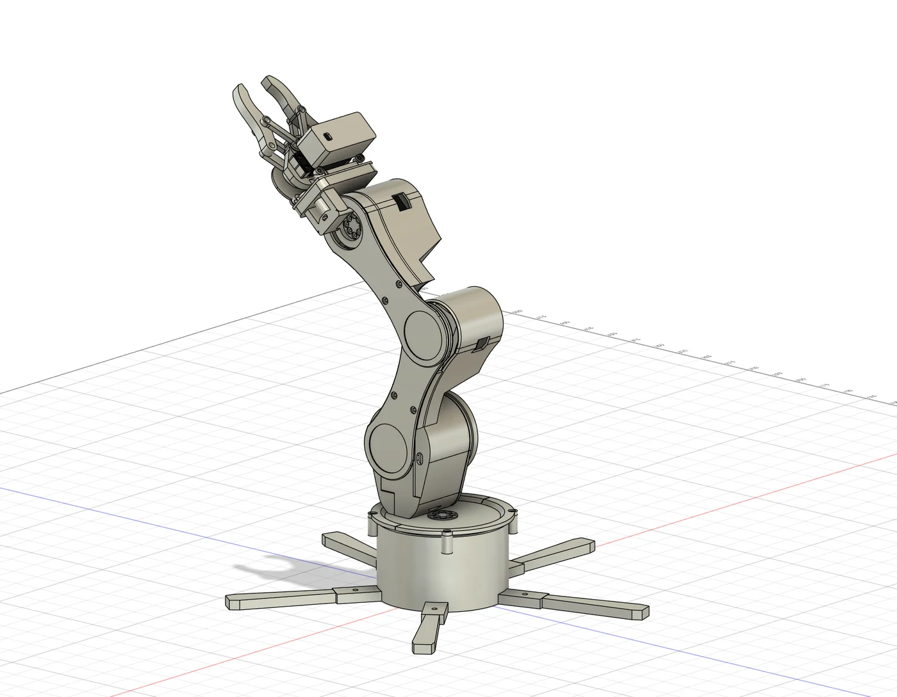

# Mechanical design and CAD

The arm was developed and modified in Fusion 360, then built from FDM-printed components, servos, and fasteners. It has four positioning joints—base, shoulder, elbow, and wrist pitch—plus a separately driven gripper.

My mechanical work focused on slimmer arm components, a wider supporting base, gripper geometry, serviceable covers, mounting details, and electronics packaging. Physical assembly and testing informed the revisions.

*Development CAD assembly. This is an earlier design view, not a new export of the current physical build.*

## What the images represent

| Reference | Meaning |
| --- | --- |
| [Current build](../media/current-build.webp) | Actual workshop photograph of the red-and-black physical arm. |
| [Earlier build](../media/earlier-build.webp) | Earlier black printed assembly with broad links and a compact base; its gripper is outside this view. |
| [CAD preview](../media/cad-preview.webp) | Fusion development geometry showing the enclosed arm, gripper, and base. |
| [Unity interface](../media/unity-interface.webp) | Simulation screenshot using an earlier CAD-derived mesh set. |
| [Enclosure CAD](../media/enclosure-cad.webp) | Later detachable electronics enclosure design; a CAD reference, not a fabrication photograph. |

The Unity conversion contains 43 assembled bodies: 33 printed-part meshes, five servo reference bodies, and five horn reference bodies. It preserves assembled transforms and joint geometry. Later mounting-hole, wrist-attachment, and enclosure changes were not imported into that mesh set. The physical build, CAD preview, and simulation therefore should not be treated as identical fabrication revisions.

## Representative revisions

- Standardized mating printed M2 screw passages around a physically accepted 3.00 mm printed-fit reference, keeping nut or metal-thread retention separate.
- Revised the forearm-to-wrist attachment as a matching pair, with aligned passages and accessible nut slots.
- Added a detachable side enclosure and later increased its internal height from 22.6 mm to 43.6 mm, with an opening connecting it to the base interior.
- Preserved working servo-body and flange interfaces while making the targeted changes.

The 3.00 mm passage is specific to this prototype and its printed fit; it is not a universal M2 hole recommendation or a threaded pilot size. The enclosure-height revision is separate from the broader earlier redesign of arm mass and base footprint.

## Scope of this repository

This repository includes reference images and design documentation. Native Fusion archives, STEP assemblies, and printable STL releases are not included. That keeps this code-focused snapshot small and avoids distributing mixed fabrication revisions or hardware reference models as a finished manufacturing package.

CAD mesh and sampled-pose checks were useful development tools. They do not establish physical load capacity, complete collision clearance, or repeatability. The enclosure revision's source record did not verify a finished printed fit.

See [design notes](../docs/design-notes.md) and the [portfolio case study](https://oluwaseuno.com/robotic-arm.html) for the physical iteration and demonstration.
