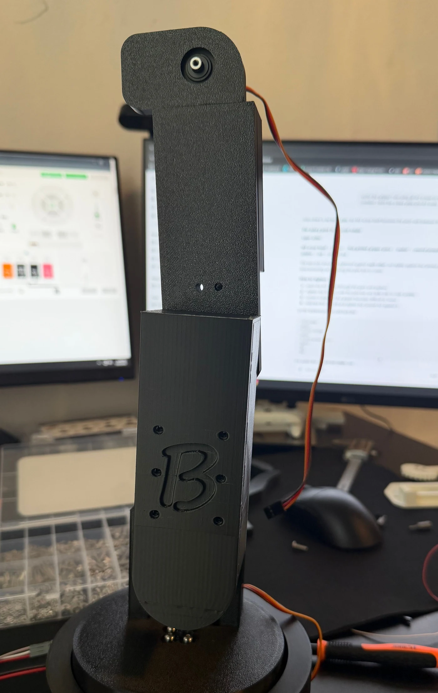
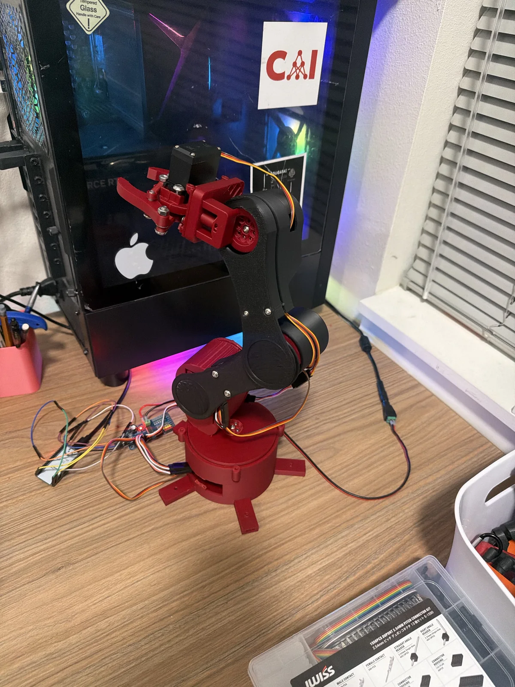
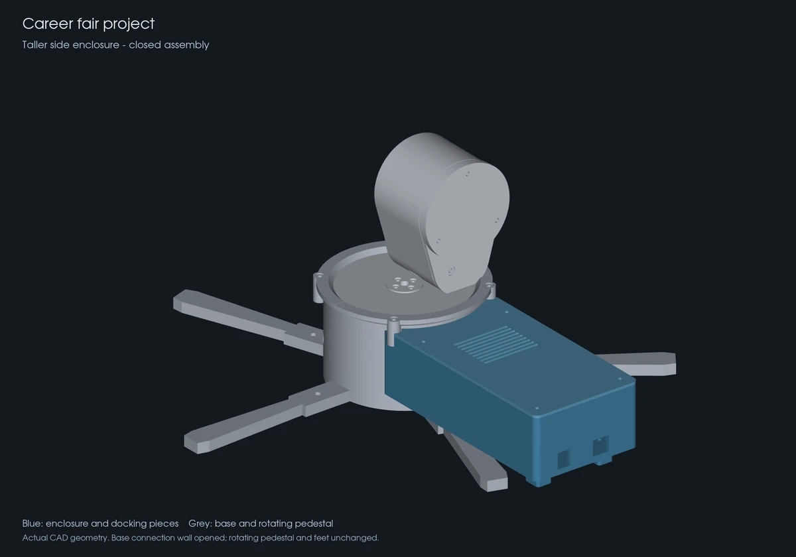

# Design notes

This project developed through repeated CAD changes, printing, assembly, and physical testing. The biggest lessons came from the gap between an assembly that looks correct on screen and one that feels stable on the bench.

## Mass, reach, and the base

The first arm was too heavy for its compact base. Its broad printed components and the reach of the structure contributed to wobbling during use. Some printed connections also had more play than I wanted.

I redesigned much of the arm: slimmer components, less unnecessary bulk, a larger base footprint, revised gripper geometry, and improved mechanical packaging. These changes improved stability in my qualitative testing. I have not measured a percentage reduction in mass, deflection, or vibration.

| Earlier assembly | Current build |
| --- | --- |
|  |  |
| Broad links and a compact cylindrical base. This photograph does not show the gripper. | Slimmer arm structure, extended base feet, and the revised wrist/gripper assembly. |

## Earlier prototypes

| Prototype | What did not work |
| --- | --- |
| Motor arm | The wiring was too exposed. |
| Official V2 Robotic Arm | The intended grid-like appearance did not work out, and the gripper was not functional enough. |
| MG996R Servo Holder | The assembly was too heavy for its base. |

These are earlier attempts, separate from the current 4-DOF build.

## CAD fit versus printed fit

Parts fitting in CAD did not guarantee a tight FDM assembly. Printed clearances, mating surfaces, and fastener access needed physical checks and further iterations. I used the fits that worked on the real parts as references rather than assuming one nominal clearance would solve every connection.

One recorded revision standardized printed M2 passages across mating parts to 3.00 mm, following an accepted printed-fit example. Separate nuts or metal threads provide retention. Another moved the forearm-to-wrist attachment holes inward and added side-entry nut slots; both mating parts were prepared as a matching reprint pair. Those CAD records confirm the intended geometry, not a measured strength or fit result for every later print.

The lesson was to prototype, assemble, inspect the unwanted play, and update the relevant geometry before treating a design as finished.

## Gripper and mechanical packaging

The earlier gripper and wrist arrangement was bulky and awkward to integrate. I refined the geometry and mounting arrangement as part of the wider redesign, while retaining a servo-driven jaw mechanism. This was a packaging and assembly improvement; gripping force, maximum payload, and grasp reliability have not been quantified.

Removable covers and a larger electronics enclosure addressed access and organization. The later side-enclosure CAD revision increased floor-to-lid internal height from 22.6 mm to 43.6 mm and opened the connection to the round base. That specific change did not resize the rotating platform or account for the entire arm redesign. It is documented here as design work, with physical enclosure fit still unverified in that revision's record.

*Enclosure design reference. The blue parts show the detachable enclosure and docking pieces; this is not a photograph of an installed enclosure.*

## Control software and physical evidence

Unity supplies joint controls, Xbox input, inverse-kinematics tools, and recording/playback of commanded model motion. The ESP32 receives commands over USB and uses the PCA9685 to drive the five servo channels. Model angles and servo commands are mapped separately.

The [portfolio demonstration](https://oluwaseuno.com/robotic-arm.html) shows the real arm moving blocks alongside the Unity interface. It demonstrates operation, but it is not a repeatability study or evidence of autonomous object detection. Recordings contain model joint angles and timing, not measured servo-shaft positions; playback does not independently confirm that a grasp succeeded.

## Development issue and next work

During repeated testing, the ESP32 occasionally needed a manual reset when reconnecting the control system. The cause was not conclusively identified. Connection handling remains an area for improvement.

Further work includes reducing mechanical play, refining coordinated movement and calibration, checking physical clearances across more poses, and measuring repeatability under stated conditions. Command-speed settings and software tests do not establish actual motor speed, payload, accuracy, or physical safety performance.
