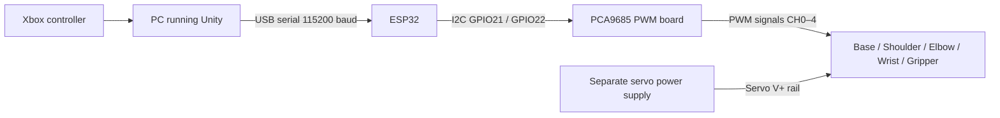

# Electronics and control architecture

The arm uses an ESP32, a PCA9685 PWM board and MG996R servos. The four positioning joints are base, shoulder, elbow and wrist pitch; a fifth servo operates the gripper. These are connected modules, not a custom PCB.

The diagram separates control signals from servo power. The external supply feeds the PCA9685 board's servo V+ rail; grounds are common with the ESP32. The ESP32 is connected to the PC by USB and does not power the servos from its 3.3 V pin.

## Connections used by the firmware

| Connection | Project configuration |
| --- | --- |
| ESP32 GPIO21 | PCA9685 SDA |
| ESP32 GPIO22 | PCA9685 SCL |
| ESP32 3.3 V | PCA9685 logic VCC |
| ESP32 GND | PCA9685 GND and servo-supply ground |
| External servo supply | PCA9685 servo V+ rail |
| PCA9685 I2C address | `0x40` |
| PWM frequency | 50 Hz |
| USB communication | 115200 baud, 8N1 |

| PCA9685 channel | Actuator |
| --- | --- |
| 0 | Base |
| 1 | Shoulder |
| 2 | Elbow |
| 3 | Wrist pitch |
| 4 | Gripper |

The exact external supply model and current rating are not recorded in this source package, so this is a system architecture reference rather than a fully specified electrical schematic or bill of materials. Use the physical board's polarity markings when making connections.

## Control boundaries

Unity handles the model, user controls, controller input and model-to-servo mapping. The ESP32 receives commands and applies validated joint targets through the PCA9685. The firmware exposes command telemetry but has no encoder feedback, load sensing or servo-power measurement.

Startup keeps PWM off until explicit activation. HOLD retains holding pulses; RELEASE disables signals but does not turn off the external servo supply. The numeric command bounds and speed setting are software limits, not proof of the mechanism's clearance, physical speed or payload capacity.

See the [firmware source and setup](../firmware/README.md) for the actual implementation and its calibration assumptions.
